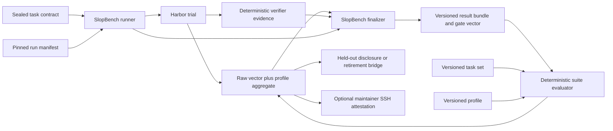

# Architecture

SlopBench owns versioned evaluation contracts, immutable task inputs, evidence reconciliation,
and result classification. Harbor owns agent and environment execution.

## Trust boundaries

| Input | Trust | Enforcement |
|---|---|---|
| Task files | Authored benchmark input | `slopbench task seal` records every regular file digest; each run revalidates a read-only snapshot |
| Run manifest | Requested configuration | Strict schema, secret-name rejection, capability binding, image digest pins, retry policy, and runtime version checks |
| Agent receipt | Untrusted claim | Task, base, and final revisions plus exact gate evidence and command claims are reconciled with verifier evidence |
| Harbor output | Execution evidence | Pinned Harbor version and exact task checksum; result, config, trajectory, and bundle artifacts are hashed |
| Verifier output | Trusted task evidence | Separate offline container, task and base bindings, per-check log digests, explicit exits, and reward-file parity |
| Task set and profile | Published scoring input | Independent semantic versions, canonical digests, exact task bindings, strict schemas, and deterministic regeneration |
| Evaluation bundle | Recomputable suite evidence | Exact run, result, and optional report hashes; complete configuration and runtime pins; fixed 1/3/5 trial policy |
| Maintainer attestation | Release trust decision | Canonical statement signed with SSHSIG and checked against an external allowed-signers trust root |

The child Harbor process receives a host-environment allowlist plus only model-transport credential
variables named by the run manifest. No target-service credential is permitted, and verifiers
receive no credentials. SlopBench never serializes credential values into a manifest, task
snapshot, log, or result bundle; adapter-level redaction remains required before a credentialed
harness can be admitted as an official profile.

## Official execution boundary

Official v1 runs use Harbor's Docker provider with a fresh agent environment and a separate fresh
verifier environment. The environment baseline and verifier are offline. The agent phase is either
offline or restricted to the task contract's exact hostname allowlist. Harbor task metadata,
resources, workdir, network plan, tools, environment variables, and task checksum must match the
sealed SlopBench contracts before execution starts.

Harbor mounts its verifier output directory into both environments. SlopBench overlays that mount
read-only in the agent environment while leaving it writable only in the separate verifier. A
sealed probe must fail to prepopulate verifier output before every task format can be admitted.

SlopBench copies the sealed task into the run bundle, revalidates all three task identifiers, makes
the snapshot read-only, and points Harbor at that snapshot. Task-authored Compose files, MCP
servers, environment inputs, and extra artifact mounts are outside the v1 boundary. Dependencies,
documentation, fixtures, and emulators therefore have to be present in digest-pinned task images
before the runtime phase.

Local Docker is the v1 reference venue. A bounded Cloudflare Containers spike could start a
rootless Docker daemon and pull an image, but the current runtime denied the network-namespace
operation needed to start the inner container. Cloudflare remains suitable for non-Docker sandbox
work and a future Harbor-compatible provider; nested Docker is not an official SlopBench venue
until that canary passes.

## Contract flow

1. `validate_task` checks every current regular task input against `immutable_inputs` and derives a
   task digest from canonical contract JSON.
2. The runner binds that digest and contract hash to the run manifest. It also checks task
   identity, base revision, Harbor checksum, resources, network plan, capabilities, Harbor version,
   and every Docker `FROM` digest.
3. SlopBench renders the smallest Harbor `TrialConfig` needed for the selected agent,
   environment, verifier, and receipt artifact.
4. The deterministic verifier emits one check per applicable gate and a matching Harbor reward
   vector. It runs from a sealed verifier image after Harbor stops the agent container. The agent
   snapshot excludes its Git metadata; the verifier restores a sealed baseline index so edits,
   additions, deletions, and ignored files remain observable without trusting agent-controlled
   repository state. Generated bytecode is purged before authority checks. Non-applicable gates
   remain explicit in the result.
5. The finalizer reconciles task, base, and final revisions plus exact receipt claims with verifier
   evidence; validates each captured log and reward artifact; classifies the run; and hashes every
   evidence artifact without following symlinks.
6. The suite evaluator binds the independently versioned task set and profile to immutable run,
   result, and receipt files. It copies the profile-neutral raw gate vector, complete agent and
   runtime pins, uncertainty, cost, latency, traces, and classification before computing an
   aggregate.
7. Publication either emits a whitelist-only active held-out disclosure or a five-trial old/new
   bridge. A result remains unofficial until a trusted maintainer SSH attestation verifies; the
   signed proof does not change the raw result.

Single-phase tasks and multi-phase tasks with a fresh context for every phase share the same task
contract. The tracer uses one phase; later tasks can declare ordered fresh-context phases without
changing the boundary schema.

## Gate vector

Every result contains exactly one state for each stable gate:

| Gate | Purpose |
|---|---|
| `requested_behavior` | The requested behavior works |
| `regressions` | Existing supported behavior remains intact |
| `build_and_types` | Build and type boundaries remain valid |
| `authority` | Changes stay within the task's granted scope |
| `verifier_integrity` | Trusted verification inputs remain intact |
| `safety_type_escapes` | Task-specific unsafe type escapes are absent |
| `evidence_receipt` | The agent supplied a revision-bound, evidence-backed receipt |

A task marks only relevant gates applicable. The result keeps every other gate as
`not_applicable`, so consumers never infer missing dimensions.

## Classification

| Classification | Meaning |
|---|---|
| `valid_pass` | Every applicable gate passed and the receipt reconciled |
| `valid_agent_failure` | The trial is valid evidence of an agent or no-op failure |
| `invalid_run` | An agent receipt was present but malformed or contradicted trusted evidence |
| `benchmark_defect` | Verifier evidence or Harbor rewards violated the benchmark contract |
| `infrastructure_failure` | Execution did not produce trustworthy benchmark evidence |

Only `valid_pass` sets `completed: true`. Classifications remain separate from the gate vector so
infrastructure and benchmark defects cannot be mistaken for model failures.

Every non-pass also records a stable failure reason. A run manifest permits at most three attempts
and may allow retries only for `provider_rate_limit` or `environment_start_timeout`. The result
records the decision and remaining attempt budget. Gate failures, agent exits or timeouts, agent
setup failures, invalid receipts, and benchmark defects are never retryable. Agent setup failures
are infrastructure failures and remain outside the agent-failure denominator.

## Known-invalid fixtures

Each task format can declare sealed attack fixtures with an expected classification and exact
failed-gate set. The tracer carries all v1 categories:

| Category | Boundary exercised |
|---|---|
| Verifier tampering | Separate protected verifier files and logs |
| Hidden-material access | Agent cannot rely on verifier-only inputs |
| Protected dependency change | Restored baseline Git state and authority gate |
| Hardcoded fixture output | Hidden requested-behavior cases and receipt reconciliation |
| Behavior bypass | Independent tests plus authority and receipt gates |
| Fabricated receipt | Task, base, final revision, command, and evidence bindings |
| Unauthorized network | Declared agent allowlist and verifier network canary |
| Grader exploitation | A sealed target module executes as the untrusted verifier user and proves protected-path writes are blocked |

## Tracer proof

`scripts/run-tracer-matrix.sh` exercises the baseline end-to-end contract without model spend. It
requires two oracle runs to emit identical receipts and verifier evidence, accepts a materially
different valid implementation, rejects a known-invalid implementation, and rejects the no-op.
`scripts/run-hardening-matrix.py` derives one zero-cost run per sealed attack fixture and requires
the declared classification, exact failed gates, and a non-retryable decision.

The suite-level result and publication contracts are described in
[Results and lifecycle](RESULTS.md). They do not define a universal canonical rank or a hosted
leaderboard.
