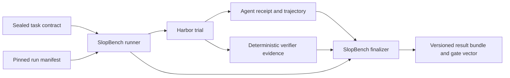

# Architecture

SlopBench owns versioned evaluation contracts, immutable task inputs, evidence reconciliation,
and result classification. Harbor owns agent and environment execution.

## Trust boundaries

| Input | Trust | Enforcement |
|---|---|---|
| Task files | Authored benchmark input | `slopbench task seal` records every file digest; each run validates the seal |
| Run manifest | Requested configuration | Strict schema, secret-name rejection, task binding, image digest pins, and runtime version checks |
| Agent receipt | Untrusted claim | Strict schema; claims, command evidence, uncertainty, and final revision are reconciled with verifier evidence |
| Harbor output | Execution evidence | Pinned Harbor version; result, config, task checksum, and any trajectory are hashed into the bundle |
| Verifier output | Trusted task evidence | Separate agent/verifier containers, task-digest binding, explicit checks and exits, and reward-vector parity |

The child Harbor process receives an environment allowlist plus only the credential variables
named by the run manifest. Credential values never enter a manifest or result bundle.

## Contract flow

1. `validate_task` checks every current task input against `immutable_inputs` and derives a task
   digest from canonical contract JSON.
2. The runner binds that digest and contract hash to the run manifest. It also checks task
   identity, resources, Harbor version, and every Docker `FROM` digest.
3. SlopBench renders the smallest Harbor `TrialConfig` needed for the selected agent,
   environment, verifier, and receipt artifact.
4. The deterministic verifier emits one check per applicable gate and a matching Harbor reward
   vector. It runs from a sealed verifier image after Harbor stops the agent container. The agent
   snapshot excludes its Git metadata; the verifier restores a sealed baseline index so edits,
   additions, and deletions remain observable without trusting agent-controlled repository state.
   Non-applicable gates remain explicit in the result.
5. The finalizer reconciles receipt claims and final revision with verifier evidence, validates
   reward parity, classifies the run, and hashes its evidence artifacts.

Single-phase tasks and multi-phase tasks with a fresh context for every phase share the same task
contract. The tracer uses one phase; later tasks can declare ordered fresh-context phases without
changing the boundary schema.

## Gate vector

Every result contains exactly one state for each stable gate:

| Gate | Purpose |
|---|---|
| `requested_behavior` | The requested behavior works |
| `regressions` | Existing supported behavior remains intact |
| `build_and_types` | Build and type boundaries remain valid |
| `authority` | Changes stay within the task's granted scope |
| `verifier_integrity` | Trusted verification inputs remain intact |
| `safety_type_escapes` | Task-specific unsafe type escapes are absent |
| `evidence_receipt` | The agent supplied a revision-bound, evidence-backed receipt |

A task marks only relevant gates applicable. The result keeps every other gate as
`not_applicable`, so consumers never infer missing dimensions.

## Classification

| Classification | Meaning |
|---|---|
| `valid_pass` | Every applicable gate passed and the receipt reconciled |
| `valid_agent_failure` | The trial is valid evidence of an agent or no-op failure |
| `invalid_run` | An agent receipt was present but malformed or contradicted trusted evidence |
| `benchmark_defect` | Verifier evidence or Harbor rewards violated the benchmark contract |
| `infrastructure_failure` | Execution did not produce trustworthy benchmark evidence |

Only `valid_pass` sets `completed: true`. Classifications remain separate from the gate vector so
infrastructure and benchmark defects cannot be mistaken for model failures.

## Tracer proof

`scripts/run-tracer-matrix.sh` exercises the current end-to-end contract without model spend. It
requires two oracle runs to emit identical receipts and verifier evidence, accepts a materially
different valid implementation, rejects a known-invalid implementation, and rejects the no-op.
